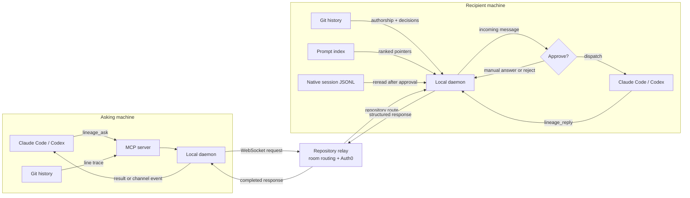

# Lineage

Git blame tells you who changed a line. Lineage tells your coding agent why.

Lineage connects Claude Code and Codex so developers can recover the prompt,
intent, assumptions, and chronology behind a change. Teammates can ask why code
exists, send context between sessions, and coordinate without leaving the CLI.

## What Lineage does

- **Explains code with provenance.** Lineage combines Git blame, structured
  decision records, and the author's private Claude or Codex history to recover
  the likely originating prompt.
- **Connects coding agents.** Questions, action requests, and one-way context
  travel between developers and agent harnesses through a repository-scoped
  relay.
- **Keeps humans in control.** A teammate cannot access local prompt history or
  agent context until the recipient approves the request.
- **Preserves decisions in Git.** Intent and decision summaries live in Git
  refs and notes without changing the worktree.
- **Catches conflicts early.** Concurrent intents surface incompatible
  assumptions before both developers commit.

Lineage is CLI-first. There is no dashboard and no required cloud database.

## How it works



- The **MCP server** exposes history, coordination, approval, and reply tools.
- The **local daemon** owns the relay connection, inbox/outbox, prompt matching,
  authorship checks, and local hooks.
- The **relay** verifies room membership and routes live structured messages. It
  does not run an LLM or store conversation history.
- The **Git store** keeps decision summaries separate from source branches.
- The **prompt index** stores metadata and pointers into native local session
  files, not copied prompt text.

## Harness support

| Capability | Claude Code | Codex |
| --- | --- | --- |
| MCP tools | Yes | Yes |
| Read local native session history | Yes | Yes |
| Send questions or context | Yes | Yes |
| Live incoming-session wake-up | Yes, through Claude Channels | No native channel API |
| Retrieve completed answers | Automatic wake-up | `lineage_requests` |

Claude Code 2.1.80 or newer is recommended for channel notifications.

## Install

Requirements:

- [Bun](https://bun.sh)
- Git
- Claude Code and/or Codex

Install Lineage from source:

```bash
git clone https://github.com/d384zhan/lineage.git
cd lineage
bun install
bun link
lineage --help
```

Run this once in every repository checkout that will use Lineage:

```bash
cd /path/to/your-project
lineage init
```

`lineage init` derives an identity from the Git origin, registers the installed
MCP servers, installs the post-commit hook, and indexes existing agent sessions.
Local state stays under `.git/lineage/`; the worktree remains unchanged.

## Quick start on the same network

### 1. Sign in once

Auth0 is recommended because it binds every message to a verified identity.
Everyone signs in once per computer:

```bash
lineage login \
  --domain dev-example.us.auth0.com \
  --client-id <native-app-client-id> \
  --audience https://lineage/api
```

The login is stored at `~/.lineage/auth.json` and refreshes automatically. See
[Auth0 setup](#auth0-setup) if the tenant is not configured yet.

### 2. Start the relay

On the host computer, from the project repository:

```bash
lineage host --port 8787
```

The terminal prints the LAN join command. Leave it running. The first time a
verified teammate connects, the host approves or rejects that identity.

### 3. Join from each computer

The host joins through localhost:

```bash
lineage join --relay ws://localhost:8787
lineage run claude
```

Other teammates use the host's LAN address:

```bash
lineage join --relay ws://<host-ip>:8787
lineage run claude
```

`lineage join` is needed once per checkout. Later sessions only need:

```bash
lineage run claude
# or
lineage run codex
```

The first `lineage run` process owns the repository daemon, so keep that session
open while other sessions use it.

### Token-only local mode

For a fast demo without Auth0:

```bash
# Host
lineage host --no-auth0 --port 8787

# Each participant uses the token printed by the host
lineage join --relay ws://<host-ip>:8787 --token <room-token> --user <name>
lineage run claude
```

This mode verifies possession of the shared token, not personal identity.

## Use Lineage from your agent

Once launched through `lineage run`, ask naturally. MCP carries structured
objects between agents, so no frontend or shared chat window is required.

### Ask why code exists

```text
Ask <teammate> through Lineage why src/cart.ts:42 reserves inventory before checkout.
Return the exact originating prompt if their local history can match it.
```

Lineage traces the line to a commit and asks the recipient whether to dispatch
their agent, answer manually, or reject. An approved agent receives local Git
authorship, decision history, prompt provenance, and prompt-hook context.

Recipients can be addressed by full Auth0 identity, email prefix, or a unique
Git-name token. Ambiguous names return candidate identities instead of guessing.

### Send one-way context

```text
Tell <teammate>'s agent through Lineage that I am adding reservation expiry next,
so its cart schema should leave room for an expiry timestamp. Send this as context.
```

Context does not create a reply obligation. Context from another user still
requires recipient approval.

### Connect two sessions on one computer

Start Claude twice from the same checkout:

```bash
# Terminal 1
lineage run claude

# Terminal 2
lineage run claude
```

Tell either session to send context through Lineage to your own identity. Each
terminal has a distinct session ID, so the message is injected into the other
session and not echoed back to its sender. Same-user context is accepted
automatically.

### Announce current work

Agents can announce structured implementation intent before editing. The CLI
equivalent is:

```bash
lineage announce \
  --summary "Add cart inventory reservations" \
  --file src/cart.ts \
  --assume inventory.storage=in-memory
```

If another live intent carries a conflicting value for the same assumption,
Lineage warns both developers before the changes silently diverge.

## Decision history

Lineage stores current intent in per-user Git refs and attaches decision
summaries to commits with Git notes.

```bash
# Explain a file, symbol, text query, or exact line
lineage why src/cart.ts
lineage why src/cart.ts:42

# Show the chronology for a file or symbol
lineage timeline src/cart.ts
lineage timeline --symbol reserveInventory

# Link additional reasoning to the latest commit
lineage link-commit \
  --commit HEAD \
  --rationale "Reserve early to prevent overselling" \
  --alternative "Reserve during checkout"

# Exchange Lineage refs and notes through the Git remote
lineage sync --mode both
```

Normal source commits remain unchanged. `lineage sync` transfers only Lineage
refs and notes.

## Privacy and security

- Raw prompts remain in Claude Code or Codex's native local session files.
- `~/.lineage/prompt-index.json` contains hashes, timestamps, touched files,
  and source pointers, but not raw prompt text.
- Exact prompt text is reread only after the recipient approves a request. It is
  returned transiently and is never written to Git notes or the Lineage index.
- User prompt-hook context and repository authorship summaries remain in daemon
  memory and are not persisted to Git or the relay.
- Auth0 verifies identity. The host separately approves repository membership.
- Host approvals live in `.git/lineage/members.json` with owner-only
  permissions. Revocation blocks the identity's next connection but does not
  terminate an already-connected socket.
- Room credentials, relay settings, inboxes, and outboxes stay under
  `.git/lineage/` and are not committed.

Manage approved members with:

```bash
lineage members list
lineage members approve teammate@example.com
lineage members revoke teammate@example.com
```

## Different networks

Lineage includes an optional Cloudflare Quick Tunnel wrapper:

```bash
# Keep lineage host running, then expose its port
lineage tunnel --port 8787
```

Joiners use the printed `wss://` URL. Quick Tunnels require no API key and are
best suited to temporary demos.

## Auth0 setup

Lineage uses OAuth Device Authorization Flow so terminal users can authenticate
in a browser without pasting passwords into the CLI.

1. Create a free Auth0 tenant and note its domain.
2. Create a **Native** application. Under **Advanced Settings → Grant Types**,
   enable **Device Code** and **Refresh Token**.
3. Create an Auth0 API. Use an identifier such as `https://lineage/api` and
   enable **Allow Offline Access**.
4. Grant the Native application user-delegated access to the API.
5. Add a post-login Action that copies the user's email into the access token:

   ```js
   exports.onExecutePostLogin = async (event, api) => {
     if (event.user.email) {
       api.accessToken.setCustomClaim("https://lineage.dev/email", event.user.email);
     }
   };
   ```

The domain, client ID, and audience can also be supplied through
`LINEAGE_AUTH0_DOMAIN`, `LINEAGE_AUTH0_CLIENT_ID`, and
`LINEAGE_AUTH0_AUDIENCE`.

## CLI reference

```text
lineage init           Initialize MCP, Git metadata, and the private prompt index
lineage run            Launch Claude or Codex with Lineage messaging
lineage host           Start a repository relay
lineage join           Save relay and identity settings for a repository
lineage login          Authenticate this computer through Auth0
lineage logout         Remove the machine-wide Auth0 login
lineage members        List, approve, or revoke repository members
lineage ask            Send a question, action request, or one-way context
lineage inbox          List received messages and their status
lineage reply          Answer an inbound request by ID
lineage announce       Publish current implementation intent
lineage complete       Complete or cancel an intent
lineage link-commit    Attach structured reasoning to a commit
lineage why            Explain a file, symbol, text query, or exact line
lineage timeline       Show decision chronology
lineage sync           Push or fetch Lineage Git refs and notes
lineage index          Refresh the private Claude and Codex history index
lineage identity       Inspect or add Git identities
lineage tunnel         Expose a relay through a Cloudflare Quick Tunnel
```

Every command supports `--json` for structured output.

## Development

```bash
bun install
bun run typecheck
bun test
```

See [CONTRACTS.md](./CONTRACTS.md) for protocol and persistence contracts.

## Roadmap

- Durable delivery for offline recipients
- Native live wake-ups across more agent harnesses
- Explicit routing among three or more sessions on one computer
- A daemon lifecycle independent of the first agent session
- Hosted relays and durable multi-tenant storage
- Immediate disconnection when a host revokes an active member
